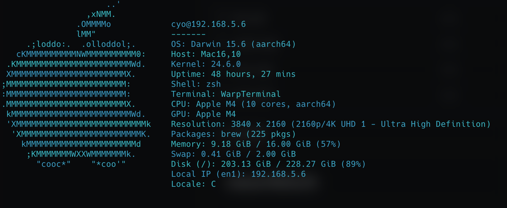
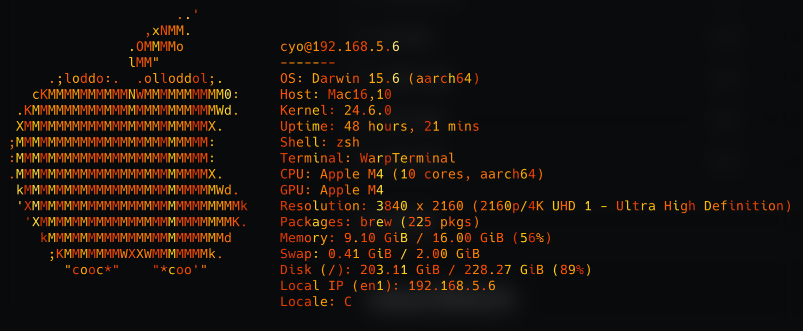
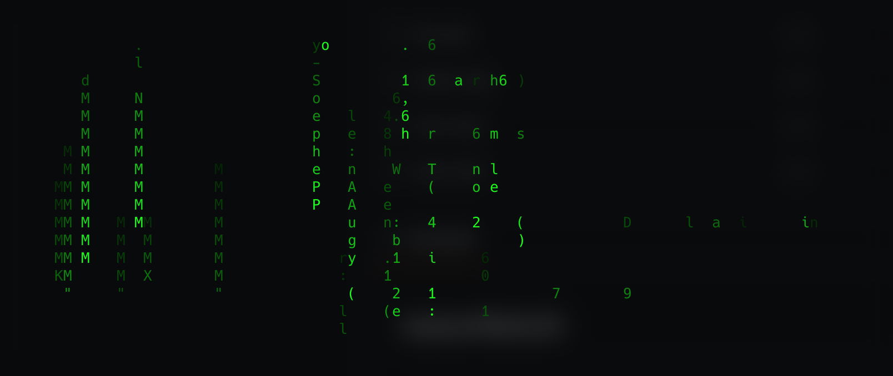
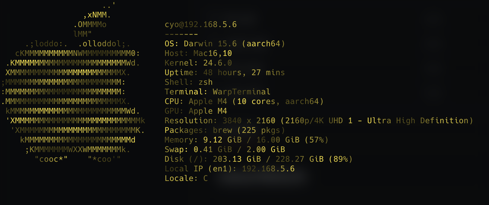

# Neonfetch 🌈

A fast, colorful, and animated system information fetch tool written in Rust. Neonfetch displays your system information with beautiful ANSI animations and
multiple visual styles.

   

## Features

- **16 Animation Styles**: Choose from various eye-catching visual effects
- **Real-time System Info**: CPU, memory, disk, GPU, network, and more
- **Cross-platform**: Works on macOS and Linux
- **Customizable Speed**: Adjust animation speed to your preference
- **Smooth Performance**: Optimized for minimal CPU usage
- **ASCII Art**: Platform-specific logos and branding

## Installation

### From Source

Install directly from the latest commit (Git HEAD) without cloning:

```bash
cargo install --locked --git https://github.com/oriys/neonfetch neonfetch
```

Or clone and then install the binary into your Cargo bin directory (adds stripping & reuse of dependencies):

```bash
git clone https://github.com/oriys/neonfetch
cd neonfetch
cargo install --path . --locked
```

Just building locally (binary stays in target/):

```bash
git clone https://github.com/oriys/neonfetch
cd neonfetch
cargo build --release
```

The binary will be available at `target/release/neonfetch`.

### Dependencies

- Rust 2024 edition or later
- System dependencies are automatically handled by Cargo

## Usage

### Basic Usage

```bash
# Run with default neon style
neonfetch

# Show system info once without animation
neonfetch --fetch
```

While an animation is running, press `q`, `Esc`, or `Ctrl+C` to quit. The
terminal (cursor, colors, input mode) is always restored on exit, including
on panics.

### Animation Styles

Choose from 16 different animation styles:

```bash
# Neon glow effect (default)
neonfetch --style neon

# Matrix digital rain
neonfetch --style matrix

# Fire particle system
neonfetch --style fire

# Falling letters with physics
neonfetch --style fall

# Aurora borealis effect
neonfetch --style aurora

# Plasma waves
neonfetch --style plasma

# And many more...

# Pick a random style
neonfetch --style random

# List all available styles
neonfetch --list-styles
```

#### Available Styles

| Style         | Alias            | Description                   |
| ------------- | ---------------- | ----------------------------- |
| `neon`        | `n`              | Glowing neon effect (default) |
| `wave`        | `w`              | Color wave animation          |
| `pulse`       | `p`              | Pulsing color effect          |
| `matrix`      | `m`              | Matrix-style digital rain     |
| `fire`        | `f`              | Fire particle system          |
| `fall`        | `s`, `stack`     | Physics-based falling letters |
| `marquee`     | `mq`             | Scrolling marquee effect      |
| `typing`      | `t`, `type`      | Typewriter animation          |
| `plasma`      | `ps`             | Plasma wave patterns          |
| `glow`        | `g`              | Soft glow effect              |
| `pixel`       | `px`             | Retro pixel color cycling     |
| `aurora`      | `au`, `northern` | Aurora borealis               |
| `glitch`      | `gl`             | Digital glitch effect         |
| `pulse-rings` | `pr`, `rings`    | Expanding pulse rings         |
| `meteor-rain` | `mr`, `meteor`   | Falling meteors               |
| `lava`        | `lv`             | Lava flow effect              |
| `edge-glow`   | `eg`             | Edge highlighting             |

### Command Line Options

```bash
# Set animation speed (0.1 - 20.0, default: 1.0)
neonfetch --speed 2.0
neonfetch -s 0.5

# Set color refresh rate (5.0 - 120.0 FPS, default: 30.0)
neonfetch --color-fps 60

# Limit animation duration in seconds
neonfetch --duration 5

# Render a single frame and exit (useful for screenshots)
neonfetch --frame

# Hide ASCII logo (show only info list)
neonfetch --no-logo
neonfetch -L

# JSON output (machine-readable keyed object, prints and exits)
neonfetch --json
neonfetch --json --hide network

# Grayscale or plain text (no ANSI colors)
neonfetch --mono
neonfetch --no-color

# Show only selected info fields in the requested order
neonfetch --show os,cpu,memory

# Hide selected info fields
neonfetch --hide network,packages

# List available info field keys
neonfetch --list-fields

# Hide package manager detection
neonfetch --no-packages
neonfetch -P

# Hide the username@hostname header
neonfetch --no-header

# Deterministic animations with a fixed random seed
neonfetch --seed 42

# Combine options
neonfetch --style fire --speed 1.5 --color-fps 45 --no-logo
```

### Examples

```bash
# Slow matrix effect
neonfetch --style matrix --speed 0.3

# Fast fire animation
neonfetch --style fire --speed 3.0

# Smooth aurora with high refresh rate
neonfetch --style aurora --color-fps 60

# Quick system info without animation
neonfetch --fetch

# Quick info without network or package fields
neonfetch --fetch --hide network,packages

# Only OS, CPU, and memory in that order
neonfetch --fetch --show os,cpu,memory
```

## System Information Displayed

Neonfetch shows comprehensive system information including:

- **Header**: Username and hostname
- **OS**: Operating system and version
- **Host**: Computer model
- **Kernel**: Kernel version
- **Uptime**: System uptime
- **Shell**: Current shell
- **Terminal**: Terminal emulator
- **CPU**: Processor model, core count, architecture, and base frequency when available
- **Cores**: Physical/logical core detail
- **GPU**: Graphics card information
- **Resolution**: Display resolution
- **Battery**: Battery percentage and status when available
- **Packages**: Installed package count
- **Temperature**: Average thermal sensor reading when available
- **Memory**: RAM usage and total
- **Swap**: Swap usage or disabled status
- **Disk**: Storage usage
- **Network**: Active network interface and IP
- **Locale**: Current locale

Use `--show <keys>` to whitelist fields and control their output order, or
`--hide <keys>` to remove selected fields from the default order. `--show` and
`--hide` are mutually exclusive. Unknown keys print a warning to stderr and are
ignored. Legacy `--no-packages`/`-P` and `--no-header` are kept as hide aliases.
Available keys are listed by `neonfetch --list-fields`.

## Technical Details

### Performance

- Frame pacing is wall-clock based: `--color-fps` caps the real frame rate,
  and `--speed` only accelerates the animation clock, so CPU usage stays flat
  at any speed
- Each frame is rendered into a single reused buffer and written to the
  terminal with one `write` + `flush`; consecutive cells with the same color
  share one ANSI escape sequence
- System info probes (GPU, packages, battery, ...) run in parallel threads at
  startup only when their fields are selected

### Platform Support

- **macOS**: Full support with native system information gathering
- **Linux**: Full support with comprehensive hardware detection
- **Windows**: Not currently supported

### Dependencies

- `crossterm`: Cross-platform terminal manipulation and input events
- `sysinfo`: System information gathering
- `fastrand`: Fast random number generation for effects
- `get_if_addrs`: Network interface detection
- `serde_json`: `--json` output

## Development

### Building

```bash
# Debug build
cargo build

# Release build (recommended)
cargo build --release

# Run tests
cargo test
```

### Project Structure

```
src/
├── main.rs              # CLI parsing, frame loop, terminal guard, renderers
├── animation/           # Animation styles and effects
│   ├── mod.rs          # Animation module exports
│   ├── styles.rs       # Style definitions and per-cell color functions
│   ├── aurora.rs       # Aurora borealis effect
│   ├── fall.rs         # Falling-letters physics simulation
│   ├── fire.rs         # Fire gradient (sparks overlaid in main loop)
│   ├── marquee.rs      # Sweeping highlight band
│   ├── matrix.rs       # Matrix digital rain
│   ├── meteor.rs       # Diagonal meteor streaks
│   ├── plasma.rs       # Plasma wave effects
│   └── ...            # Other animation implementations
├── system/             # System information gathering
│   ├── mod.rs         # System module exports
│   ├── info.rs        # Main system info collection
│   ├── logo_macos.rs  # macOS ASCII art
│   └── logo_linux.rs  # Linux ASCII art
└── util/              # Utilities
    ├── mod.rs         # Utility module exports
    ├── ansi.rs        # ANSI escape sequence parsing
    └── framebuf.rs    # Reusable frame buffer with color-run deduplication
```

## Contributing

Contributions are welcome! Please feel free to submit pull requests or open issues for:

- New animation styles
- Performance improvements
- Platform-specific enhancements
- Bug fixes
- Documentation improvements

## License

This project is licensed under the MIT License. See the LICENSE file for details.

## Acknowledgments

- Inspired by the original `neofetch` tool
- Built with the amazing Rust ecosystem
- Thanks to all contributors and users

---

_Neonfetch - Making system information beautiful, one animation at a time._ ✨
